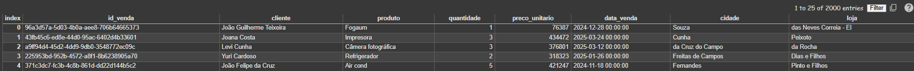

## 📖 Introdução  
Este projeto tem como objetivo **padronizar nomes de produtos** em uma base de vendas utilizando **fuzzy matching**.  

Em bases reais, é comum encontrar:  
- 📝 **Erros de digitação** (ex: "Celular Sansung" → "Celular Samsung")  
- 🔤 **Abreviações** (ex: "TV 42" → "Televisão 42 polegadas")  
- ✨ **Diferenças de acentuação** (ex: "Pão" → "Pao")  

Essas inconsistências podem atrapalhar análises e relatórios, já que o mesmo produto aparece de várias formas.  

➡️ A solução aqui proposta:  
- **Encontra correspondências aproximadas** e converte para um **produto padrão**, mantendo o valor original quando a correspondência não é confiável.  
- **Gera um depara automático** de produtos, consolidando variações e erros de digitação.  
- Pode ser facilmente **replicada em Spark**, permitindo escalabilidade para bases muito maiores.  

Essa abordagem garante **uma base mais limpa e confiável**, essencial para dashboards, relatórios e análises de vendas.

---

## 1️⃣ Instalando as bibliotecas necessárias

```bash
# Para fuzzy matching
pip install rapidfuzz

# Para normalização de acentos e caracteres especiais
pip install Unidecode

```

## 2️⃣ Upload da base de dados

No Google Colab, você pode fazer upload do Excel diretamente:

```bash
from google.colab import files
import pandas as pd

# Fazendo upload do arquivo Excel
uploaded = files.upload()

# Lendo a planilha "base_vendas"
df_base = pd.read_excel("projeto_fuzzy_matching.xlsx", sheet_name="base_vendas")

# Conferindo as primeiras linhas
df_base
```


## 3️⃣ Preparando a lista de produtos padrão

```bash
from rapidfuzz import process, fuzz
from unidecode import unidecode

# Lista de produtos padrão
produtos_padrao = [
    "Notebook", "Smartphone", "Geladeira", "Televisão", "Fogão",
    "Micro-ondas", "Cafeteira", "Liquidificador", "Ventilador", "Ar-condicionado",
    "Aspirador de pó", "Máquina de lavar", "Secadora", "Impressora", "Câmera"
]

# Normalizando produtos para comparação (removendo acentos e deixando minúsculo)
produtos_padrao_normalizados = [unidecode(p).lower() for p in produtos_padrao]

```

## 4️⃣ Função de mapeamento fuzzy

```bash
def mapear_produto_condicional(produto):
    # Compara o produto com a lista de produtos padrão usando fuzzy matching. Se a melhor correspondência tiver score >= 63, retorna o produto padrão. Caso contrário, mantém o produto original.
    if not produto or pd.isna(produto):
        return produto  # mantém original se estiver vazio
    
    produto_normalizado = unidecode(produto).lower().strip()
    melhor_match = process.extractOne(produto_normalizado, produtos_padrao_normalizados, scorer=fuzz.token_sort_ratio)
    
    if melhor_match and melhor_match[1] >= 63: # aqui eu defini o melhor score possivel.. percebi que abaixo de 63 o código começava a atrelar produtos de forma errada no depara...
        index = produtos_padrao_normalizados.index(melhor_match[0])
        produto_final = produtos_padrao[index]
        return produto_final
    else:
        # score baixo → mantém produto original
        return produto

```

## 5️⃣ Criando o depara de produtos

```bash
# Criando DataFrame com produto original e produto padrao
df_depara = pd.DataFrame({
    'produto': df_base['produto'],
    'produto_padrao': df_base['produto'].apply(mapear_produto_condicional)
})

# Removendo duplicatas
df_depara = df_depara.drop_duplicates().reset_index(drop=True)

# Conferindo o resultado
df_depara.head(20)

```

## 6️⃣ Aplicando left join para trazer produto_padrao

```bash
# Fazendo left join para manter todas as colunas originais
df_final = df_base.merge(df_depara, on='produto', how='left')

# Selecionando colunas para deixar produto e produto_padrao lado a lado
colunas_final = ['produto', 'produto_padrao'] + [col for col in df_base.columns if col != 'produto']
df_final = df_final[colunas_final]

# Conferindo resultado
df_final

```


## 📊 Resultados

Após aplicar o fuzzy matching para padronizar os produtos:

- **Qtd de produtos únicos antes do tratamento:** 75  
- **Qtd de produtos únicos depois do tratamento:** 43  
- **Redução de produtos distintos:** 32 (42,67% de melhora)

Essa redução mostra claramente que a padronização ajudou a consolidar variações e erros de digitação, deixando a base mais limpa e confiável para análises e dashboards.
